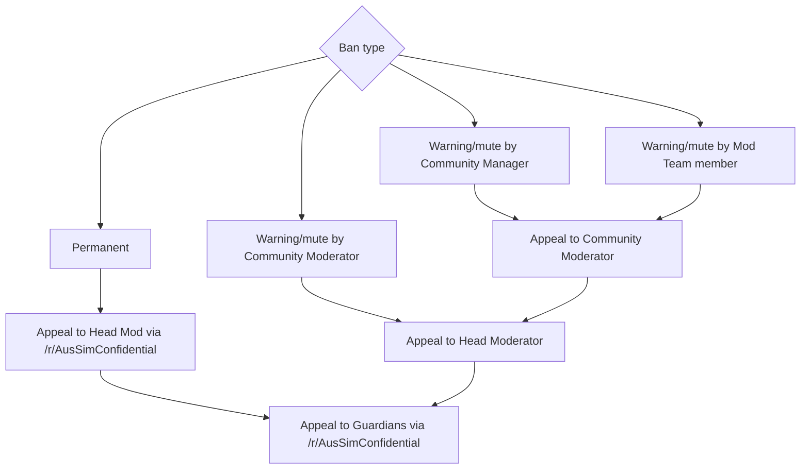

# Appeals

# Enforcement 

!!! warning "Abusing the Code of Conduct"
    Do not attempt to misuse the Code of Conduct or moderation processes
    This includes but is not limited to Making false reports, or pinging moderators over things that aren’t reportable.
    Reports in good faith, even if unsuccessful, are not misuse.
    Do not lie, attempt to deceive or commit fraud during engagements with moderators. 
    Do not circumvent punishments.
    This includes by alting, or posting in other places due to a permissions error. 

Under the Code of Conduct, Community Managers, the Community Moderator, and the Head Moderator may make actions against breaches of the rules by users. 

Community Managers may only issue sentences up to a maximum of three days. If the correct sentence exceeds this limit, the Community Moderator can issue an interim mute until the Community Moderator or Head Moderator formalises a penalty.

All penalites except a warning must be made publicly logged via Discord.

Moderators may also make declarations to bar discussion of topics for an interim time where necessary in order to restore civility to the discord and/or stop further poor behaviour. These declarations are enforceable under this document as a breach of whatever relevant factor led to the declaration.
